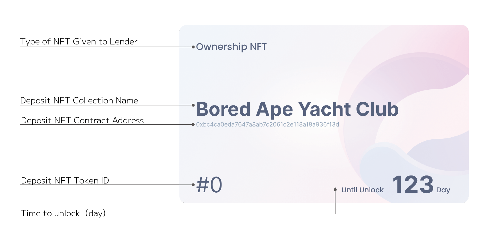

# OwnershipNFT

OwnershipNFT is issued to the lender when the NFT is deposited.

OwnershipNFT transfers the locked NFT to the owner of the OwnershipNFT when it burns at the end of the lock period. It is also possible to operate it with an external service.OwnershipNFT effectively represents ownership of the original NFT, so it can be operated by an outside service.

Please refer to the following pages for specific OwnershipNFT use cases,


[ownershipnft.md](../../use-cases/ownershipnft.md)

