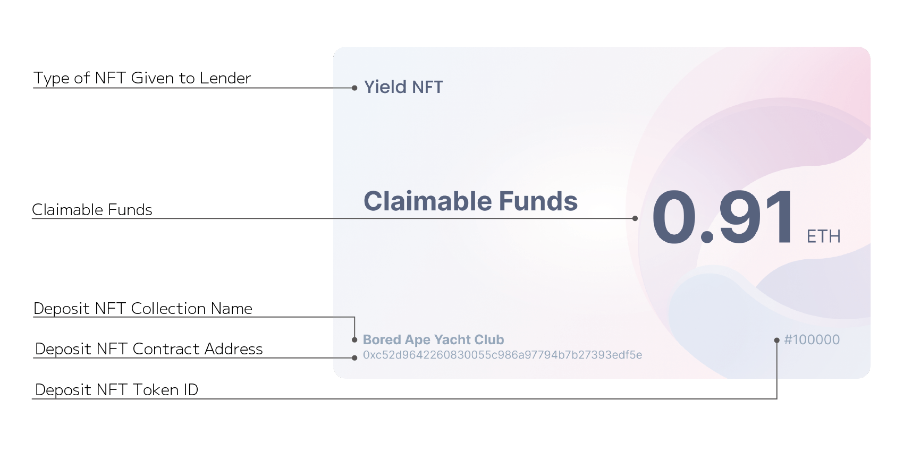

# YieldNFT

YieldNFT is issued to the lender when an NFT is locked.

YieldNFT can be redeemed at the end of the lock period for the total amount of rental fee traded during the lock period. yieldNFT earned profit can be found in YieldNFT metadata.

Please refer to the following pages for specific YieldNFT use cases,


[yieldnft.md](../../use-cases/yieldnft.md)

